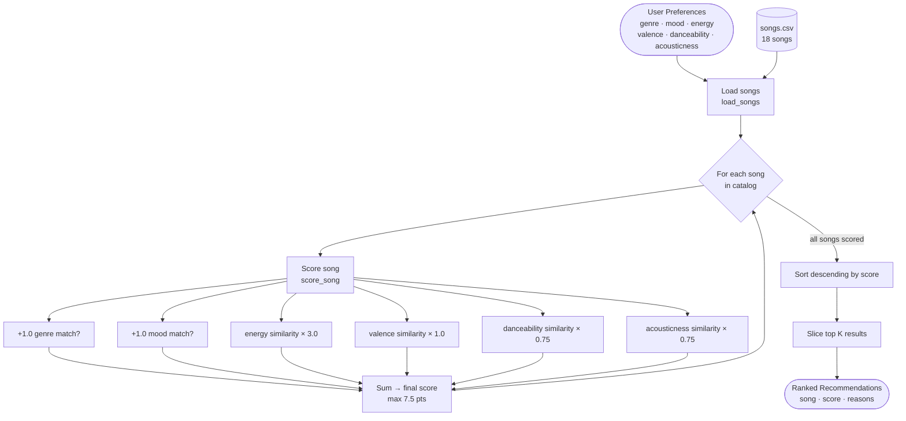

# 🎵 VibeFinder 1.0 — Music Recommender Simulation

## Project Summary

VibeFinder is a content-based music recommender built as a classroom simulation. It scores every song in an 18-track catalog against a user's taste profile and returns the top 5 matches with plain-language explanations. No user history, no collaborative filtering — just arithmetic on song features.

The project demonstrates how simple scoring rules can produce results that feel like real recommendations, and where those rules break down.

---

## Data Flow



---

## How The System Works

Every song in the catalog is scored against the user's taste profile. Scoring happens in two layers:

**Layer 1 — Categorical matches (binary)**

| Rule | Points |
|---|---|
| Genre matches user's preferred genre | +1.0 |
| Mood matches user's preferred mood | +1.0 |

**Layer 2 — Numeric proximity**

```
proximity = 1 - |song_value - user_target|
```

A perfect match scores 1.0; the further apart, the closer to 0.0. Each feature is multiplied by its weight:

| Feature | Weight | Rationale |
|---|---|---|
| energy | ×3.0 | Biggest driver of how a song feels |
| valence | ×1.0 | Emotional tone — bright vs. dark |
| danceability | ×0.75 | Groove feel |
| acousticness | ×0.75 | Organic vs. electronic texture |

Max possible score: **7.5 points** (1.0 + 1.0 + 3.0 + 1.0 + 0.75 + 0.75)

After every song is scored, the list is sorted descending and the top K are returned with a reason string explaining which features matched.

---

## Known Biases and Limitations

- **Single-song genre trap.** 13 of 15 genres appear only once. Any user preferring rock, jazz, metal, or folk always gets the same #1 — the genre bonus is unbeatable with no competition.
- **Binary mood penalty.** Mood is an exact string match. "Relaxed" scores zero against a "chill" target even though they feel similar. Users with rare mood preferences are silently penalized.
- **Energy dominance.** At ×3.0, energy is the strongest signal by far. A song 0.30 off on energy loses up to 0.90 points, pushing otherwise good matches out of the top 5.
- **No diversity enforcement.** The lofi listener gets all three lofi songs before any cross-genre discovery. Results cluster rather than explore.
- **Tempo is unused.** `tempo_bpm` is loaded but not scored.

---

## Sample Output

Running `python -m src.main` produces results for six profiles — three standard and three adversarial edge cases.


### Profile 1: High-Energy Pop

```
══════════════════════════════════════════════════════
  🎵  Profile 1: High-Energy Pop
  genre=pop  mood=happy  energy=0.85
──────────────────────────────────────────────────────
  #1  Sunrise City  —  Neon Echo
       Score : 6.92 / 7.00
       Why   : genre match, mood match, close energy, close valence, close danceability, close acousticness

  #2  Gym Hero  —  Max Pulse
       Score : 5.67 / 7.00
       Why   : genre match, close energy, close valence, close danceability, close acousticness

  #3  Rooftop Lights  —  Indigo Parade
       Score : 4.66 / 7.00
       Why   : mood match, close energy, close valence, close danceability

  #4  Neon Horizon  —  Pulse Array
       Score : 3.74 / 7.00
       Why   : close energy, close valence, close danceability, close acousticness

  #5  Groove Architect  —  Funky Dimension
       Score : 3.73 / 7.00
       Why   : close energy, close valence, close danceability, close acousticness
══════════════════════════════════════════════════════
```

Sunrise City hits every signal (6.92/7.00). Gym Hero loses the mood bonus because it's tagged "intense" not "happy".

---

### Profile 2: Chill Lofi

```
══════════════════════════════════════════════════════
  ☁️   Profile 2: Chill Lofi
  genre=lofi  mood=chill  energy=0.4
──────────────────────────────────────────────────────
  #1  Midnight Coding  —  LoRoom
       Score : 6.88 / 7.00
       Why   : genre match, mood match, close energy, close valence, close danceability, close acousticness

  #2  Library Rain  —  Paper Lanterns
       Score : 6.83 / 7.00
       Why   : genre match, mood match, close energy, close valence, close danceability, close acousticness

  #3  Focus Flow  —  LoRoom
       Score : 5.97 / 7.00
       Why   : genre match, close energy, close valence, close danceability, close acousticness

  #4  Spacewalk Thoughts  —  Orbit Bloom
       Score : 4.50 / 7.00
       Why   : mood match, close energy, close valence

  #5  Coffee Shop Stories  —  Slow Stereo
       Score : 3.70 / 7.00
       Why   : close energy, close valence, close danceability, close acousticness
══════════════════════════════════════════════════════
```

All three lofi tracks dominate the top 3. Spacewalk Thoughts sneaks in at #4 on mood match alone — a cross-genre result that actually makes sense.

---

### Profile 3: Deep Intense Rock

```
══════════════════════════════════════════════════════
  🤘  Profile 3: Deep Intense Rock
  genre=rock  mood=intense  energy=0.92
──────────────────────────────────────────────────────
  #1  Storm Runner  —  Voltline
       Score : 6.76 / 7.00
       Why   : genre match, mood match, close energy, close valence, close danceability, close acousticness

  #2  Gym Hero  —  Max Pulse
       Score : 4.29 / 7.00
       Why   : mood match, close energy, close acousticness

  #3  Shatter the Crown  —  Iron Veil
       Score : 3.83 / 7.00
       Why   : close energy, close valence, close danceability, close acousticness

  #4  Night Drive Loop  —  Neon Echo
       Score : 3.36 / 7.00
       Why   : close valence, close acousticness

  #5  Concrete Jungle  —  Asphalt Kings
       Score : 3.35 / 7.00
       Why   : close energy, close acousticness
══════════════════════════════════════════════════════
```

Only one rock song in the catalog so #1 is a lock. The 2.47-point gap to #2 shows how much the genre bonus matters when there's no competition.

---

### Edge Case 1: Conflicting Energy + Mood

```
══════════════════════════════════════════════════════
  ⚡  Edge Case 1: High Energy + Sad Mood (conflicting signals)
  genre=classical  mood=melancholic  energy=0.9
──────────────────────────────────────────────────────
  #1  Moonlit Sonata  —  Clara Voss
       Score : 5.81 / 7.00
       Why   : genre match, mood match, close valence, close danceability, close acousticness

  #2  Shatter the Crown  —  Iron Veil
       Score : 2.94 / 7.00
       Why   : close energy, close valence
══════════════════════════════════════════════════════
```

Moonlit Sonata wins despite having energy=0.22 vs. target 0.90. The genre+mood bonus (2.0 pts) overwhelms the energy penalty. The system recommends a quiet piano piece to someone who asked for high energy — the label matched, the experience did not.

---

### Edge Case 2: Genre Ghost

```
══════════════════════════════════════════════════════
  👻  Edge Case 2: Genre ghost (no matching genre in catalog)
  genre=ambient  mood=angry  energy=0.95
──────────────────────────────────────────────────────
  #1  Shatter the Crown  —  Iron Veil
       Score : 4.51 / 7.00
       Why   : mood match, close energy, close acousticness

  #2  Spacewalk Thoughts  —  Orbit Bloom
       Score : 3.43 / 7.00
       Why   : genre match
══════════════════════════════════════════════════════
```

Spacewalk Thoughts ranks #2 purely on genre label despite being a peaceful ambient track — the polar opposite of the angry/high-energy profile.

---

### Edge Case 3: All-Middle Preferences

```
══════════════════════════════════════════════════════
  🎭  Edge Case 3: All-middle preferences (no strong signal)
  genre=reggae  mood=nostalgic  energy=0.5
──────────────────────────────────────────────────────
  #1  Dusty Backroads  —  The Hollow Pines
       Score : 4.39 / 7.00
       Why   : mood match, close energy, close danceability

  #5  Library Rain  —  Paper Lanterns
       Score : 3.34 / 7.00
       Why   : close energy, close valence, close danceability
══════════════════════════════════════════════════════
```

Scores cluster between 3.34–4.39 with no strong signal. The system has low confidence and results feel arbitrary — this is where a real recommender would fall back to popularity or editorial picks.

---

## Experiments

**Weight shift:** halved genre bonus (2.0 → 1.0), doubled energy weight (1.5 → 3.0). The genre ghost edge case improved — the quiet ambient song stopped appearing for a high-energy angry profile. The classical/melancholic edge case still misbehaved, just with a smaller margin. Categorical bonuses still dominated when both genre and mood matched.

**Key finding:** changing weights alone does not fix the binary matching problem. A song that matches the genre label will always beat one that doesn't, regardless of how small the bonus is. Fixing it requires a structural change — soft genre similarity or partial mood credit — not just a number tweak.

---

## Getting Started

1. Create a virtual environment (optional):

   ```bash
   python -m venv .venv
   source .venv/bin/activate      # Mac / Linux
   .venv\Scripts\activate         # Windows
   ```

2. Install dependencies:

   ```bash
   pip install -r requirements.txt
   ```

3. Run the recommender:

   ```bash
   python -m src.main
   ```

4. Run tests:

   ```bash
   pytest
   ```

---

## Project Files

| File | Purpose |
|---|---|
| `src/recommender.py` | Core logic — `load_songs`, `score_song`, `recommend_songs`, `Recommender` class |
| `src/main.py` | CLI runner — six user profiles, formatted terminal output |
| `data/songs.csv` | 18-song catalog with audio features |
| `model_card.md` | Full model card — intended use, data, biases, evaluation, reflection |
| `reflection.md` | Plain-language profile comparisons and analysis |
| `tests/test_recommender.py` | Unit tests |

---

## Reflection

The biggest learning moment was realising that the weight-shift experiment did not fix the core problem. I expected halving the genre weight to make recommendations more diverse. It improved one edge case but barely changed the others. The real issue is that binary label matching — genre either matches or it doesn't — means a song with the right label always beats one without it, no matter how small the bonus. Fixing that requires soft genre similarity, not a number change.

What surprised me most was how much the results felt like real recommendations even though the algorithm is just arithmetic. Sunrise City ranking first for a happy pop listener, Midnight Coding for a chill lofi listener — those feel right. The system is not intelligent; it is measuring distance. But distance in the right feature space produces outputs that match human intuition more often than you'd expect. The failures (Moonlit Sonata for a high-energy user) are the cases where the feature space doesn't capture what the user actually means.

[Full model card →](model_card.md) · [Profile comparison notes →](reflection.md)
